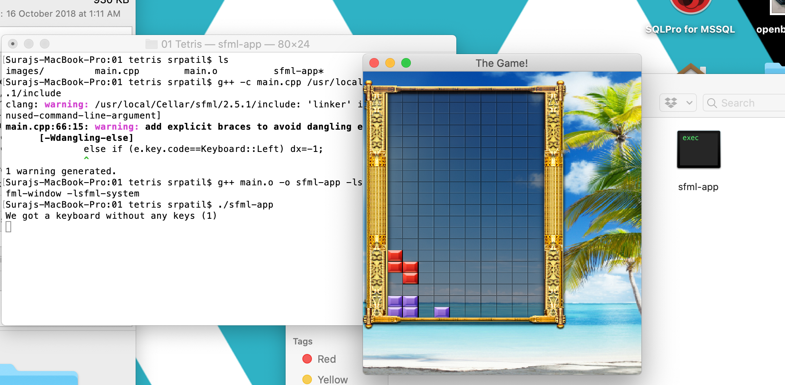

# 16 Games in SFML

This is repository contains the source code 16 Games developed in C++ and [SFML](https://www.sfml-dev.org/) by a YouTube channel called ["FamTrinli"](https://www.youtube.com/channel/UCC7qpnId5RIQruKDJOt2exw).

SFML stands for Simple and Fast Multimedia Library. It provides a simple interface to the various components of your machine, to ease the development of games and multimedia applications. It is composed of five modules: system, window, graphics, audio and network. With SFML, your application can compile and run out of the box on the most common operating systems: Windows, Linux, macOS and soon Android & iOS. SFML has official bindings for the C and .Net languages. And thanks to its active community, it is also available in many other languages such as Java, Ruby, Python, Go, and more. But it is worth mentioning that C++ is the go-to language in Game Development. C and C++ underlies nearly all modern software and programming languages today. Many “toy” languages such as Python and Ruby and others are just scripting languages, really, calling C and C++ libraries under the hood.

C++ became the predominant game programming language because it is Object Oriented and was compiled, so it was nearly as fast as straight C if not faster. Java and C# are both Object Oriented, but don’t compile to machine language like C++. Because the de-facto language for game development is C++, a whole ecosystem grew around it. But now, the two most popular game engines are Unity (uses C#) and Unreal (uses C++). Unity is a lot more beginner friendly than Unreal. C and C++ underlies nearly all modern software and programming languages today. Java is a good OO language with good libraries and API's. But it should never be used for high-requirement games. And because Python interpreted at runtime, it hinders performance and doesn't scale well. C++ is the go-to game development language. As a rule of thumb, when you convert optimized C++ to Java, the code is about 3x slower. But large projects tend to be easier to optimize in Java, because JVM handles many optimizations like Concurrent data structures and dynamic memory management.

## Installation and Running

After you fork this repository, you must download SFML. I am running this on MacOS, and even though there are specific instructions on how to install SFML on Xcode, I don't like using Xcode. I simply
prefer using the terminal, so I am writing the modified instructions for how to install SMFL for Linux/Unix systems.

1. Run the following command on the terminal
	
		brew install sfml		

2. Change directory to the desired game. And then compile the source code. 

Since we installed SFML to a non-standard path, we need to tell the compiler where to find the SFML headers (.hpp files):
		
		g++ -c main.cpp /usr/local/Cellar/sfml/2.5.1/include

3. Link the compiled file to the SFML libraries in order to get the final executable. 

SFML is made of 5 modules (system, window, graphics, network and audio), and there's one library for each of them.

		g++ main.o -o sfml-app -lsfml-graphics -lsfml-window -lsfml-system

4. Execute the compiled program

Root access is necessary so that program can accept keyboard inputs.

		sudo ./sfml-app	
